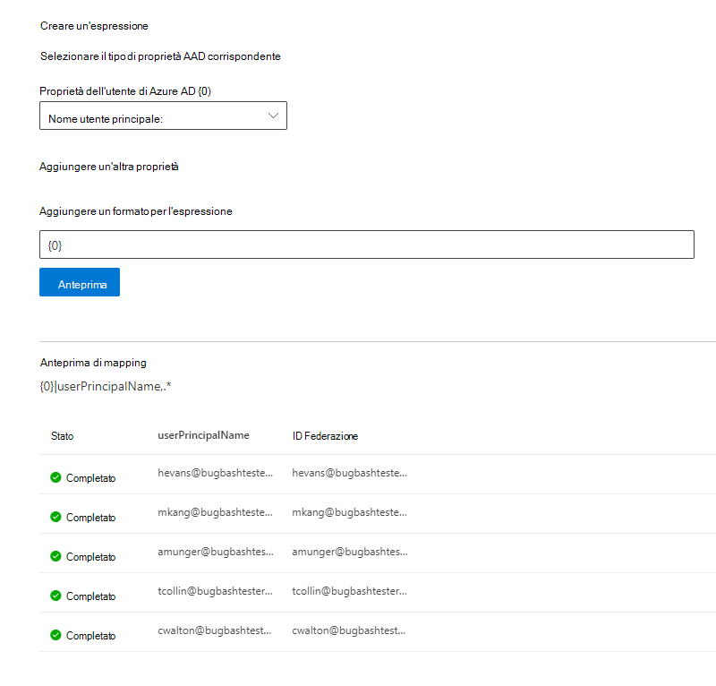

# Mappare le identità di Azure AD  

In questo articolo vengono illustrati i passaggi per la mappatura delle identità di Azure AD un identificatore univoco per l'origine dati (identità non Azure AD), in modo che gli utenti nell'elenco di controllo di accesso (ACL) con identità non Azure AD siano in grado di visualizzare i risultati della ricerca dei connettori con ambito.

Questi passaggi sono rilevanti solo per gli amministratori della ricerca che stanno configurando un connettore [Salesforce](salesforce-connector.md) da Microsoft con le autorizzazioni di ricerca per "solo gli utenti con accesso a questa origine dati" e il tipo di identità "AAD". Nei passaggi seguenti viene illustrato come eseguire il mapping delle proprietà degli utenti di Azure AD agli **ID di Federazione** degli utenti.

>[!NOTE]
>Se si sta impostando un [connettore Salesforce](salesforce-connector.md) e si selezionano **solo gli utenti con accesso a questa origine dati** e il tipo di identità **non AAD** nella schermata autorizzazioni di ricerca, fare riferimento all'articolo [Map Your non-Azure ad](map-non-aad.md) identitys per i passaggi su come eseguire il mapping delle identità di Active Directory non Azure.  

## Passaggi per il mapping delle proprietà di Azure AD

### 1. Selezionare le proprietà degli utenti di Azure Active Directory da mappare

È possibile selezionare le proprietà di Azure AD che è necessario mappare all'ID federativo.

È possibile selezionare una proprietà utente di Azure AD dal menu a discesa. È inoltre possibile aggiungere tutte le proprietà degli utenti di Azure AD come si desidera se queste proprietà sono necessarie per creare il mapping dell'ID federativo per l'organizzazione.

### 2. creare la formula per completare il mapping

È possibile combinare i valori delle proprietà degli utenti di Azure AD per formare l'ID di federazione univoco.

Nella casella formula, " {0} " corrisponde alla *prima* proprietà di Azure ad selezionata. " {1} " corrisponde alla *seconda* proprietà di Azure ad selezionata. " {2} " corrisponde alla *terza* proprietà di Azure ad e così via.  

Di seguito sono riportati alcuni esempi di formule con gli output di espressioni regolari di esempio e gli output delle formule:

| Formula di esempio                  | Valore della proprietà {0} per un utente di esempio                 | Valore della proprietà {1} per un utente di esempio           | Output della formula                  |
| :------------------- | :------------------- |:---------------|:---------------|
| {0}.{1} @contoso. com  | FirstName | LastName |firstname.lastname@contoso.com
| {0}@domain. com                 | UserID                 |             |userid@domain.com

Dopo aver fornito la formula, è possibile fare clic su **Anteprima** per visualizzare un'anteprima di 5 utenti casuali dall'origine dati con i rispettivi mapping utente applicati. L'output dell'anteprima include il valore delle proprietà dell'utente di Azure AD selezionate nel passaggio 1 per gli utenti e l'output della formula finale fornita nel passaggio 2 per tale utente. Indica anche se l'output della formula può essere risolto in un utente di Azure AD nel tenant tramite un'icona "riuscita" o "non riuscita".  

>[!NOTE]
>È comunque possibile continuare a creare la connessione se uno o più mapping degli utenti hanno uno stato "non riuscito" dopo aver fatto clic su **Anteprima**. Nell'anteprima vengono visualizzati 5 utenti casuali e i relativi mapping dall'origine dati. Se il mapping specificato non esegue il mapping di tutti gli utenti, è possibile che si verifichi questo caso.

## Mapping di Azure AD di esempio

Vedere lo snapshot seguente per un esempio di mapping di Azure AD.

## Limitazioni  

- Solo un mapping è supportato per tutti gli utenti. I mapping condizionali non sono supportati.  

- Non è possibile modificare il mapping dopo la pubblicazione della connessione.  

- Le espressioni basate su Regex rispetto alle proprietà degli utenti di Azure AD non sono supportate per la trasformazione dell'ID di Federazione di Azure ad.