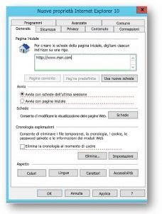

# Home page predefinita set

Configurazione il browser predefinito, motore di ricerca predefinito e home page predefinita consente agli utenti individuare funzionalità Microsoft Search, incoraggiare altri dati di utilizzo e offrire un'esperienza più uniforme.
  
Per impostare la home page predefinita per l'organizzazione, attenersi alla procedura seguente.
  
## Internet Explorer

### Internet Explorer 5.0 o versioni successive

1. Aprire la Console Gestione criteri di gruppo (GPMC) e passare alla modifica di un criterio esistente o crearne uno nuovo.
    
2. Passare alle **impostazioni di Windows\Manutenzione pannello Configuration\Preferences\Control dell'utente**.
    
3. Fare clic su **Impostazioni di Internet** e selezionare **Internet Explorer 10**.
    
    > [!NOTE]
    > È necessario selezionare l'opzione di Internet Explorer 10 per applicare le impostazioni di Internet Explorer 11 come applicano le stesse impostazioni di Internet Explorer 11. 
  
4. Non sono configurate impostazioni che sono sottolineate in rosso al computer di destinazione, mentre sottolineato verde vengono configurate in computer di destinazione. Per cambiare il carattere di sottolineatura, utilizzare i tasti funzione seguenti:
    
    F5 - Abilita tutte le impostazioni nella scheda corrente
    
    F6 - Abilita l'impostazione corrente selezionata
    
    F7 - disattiva l'impostazione corrente selezionata
    
    F8 - disabilitare tutte le impostazioni nella scheda corrente
    
5. Premere **F8** per disabilitare tutte le impostazioni prima di configurare qualsiasi operazione. La schermata dovrebbe essere simile al seguente: 
    
    
  
6. Premere **F6** l'impostazione della Home page, quindi immettere`https://www.bing.com/business?form=BFBSPR`
    
7. Applicare criteri risultante tramite il collegamento al dominio appropriato.
    
> [!NOTE]
> Gli utenti possono comunque modificare la home page dopo che questo criterio è impostato. 
  
## Microsoft Edge

### Windows 10, 1511 o versioni successive

1. Aprire la Console Gestione criteri di gruppo (GPMC) e passare alla modifica di un criterio esistente o crearne uno nuovo.
    
2. Passare a **amministrazione amministrativi\Componenti Components\Microsoft Edge**
    
1. Fare doppio clic su **pagine configurazione iniziali**, impostato su **attivato**e immettere`https://www.bing.com/business`
    
3. Applicare criteri risultante tramite il collegamento al dominio appropriato.
    
> [!CAUTION]
> Gli utenti saranno in grado di modificare il provider di ricerca dopo che questo criterio è impostato. 
  
## Google Chrome

### Windows XP SP2 o versione successiva

Articolo del supporto tecnico di Windows sulla gestione dei file ADMX e i file ADMX più recenti per diverse versioni di Windows sono disponibili [nel supporto tecnico clienti Microsoft](https://support.microsoft.com/en-us/help/3087759/how-to-create-and-manage-the-central-store-for-group-policy-administra).

È inoltre necessario il file criteri più recente di Google, che è possibile trovare nella [Guida di Google Chrome Enterprise](https://support.google.com/chrome/a/answer/187202).
  
Se le impostazioni descritte in questa sezione non viene trovate all'interno di GPMC, scaricare ADMX appropriato e copiarli nell' [archivio centrale](https://docs.microsoft.com/en-us/previous-versions/windows/it-pro/windows-vista/cc748955%28v%3dws.10%29). Archivio centrale sul controller è una cartella con la convenzione di denominazione seguente:
  
 **%systemroot%\sysvol\\<domain\>\policies\PolicyDefinitions**
  
Ogni dominio i punti di manipolazione di controller devono ottenere una cartella separata. Può utilizzare il comando seguente per copiare il file ADMX al prompt dei comandi:
  
 `Copy <path_to_ADMX.ADMX> %systemroot%\sysvol\<domain>\policies\PolicyDefinitions`
  
1. Aprire la Console Gestione criteri di gruppo (GPMC) e passare alla modifica di un criterio esistente o crearne uno nuovo.
    
2. Verificare che le cartelle seguenti vengono visualizzati nella sezione **Modelli amministrativi** di entrambe *Configurazione utente/Computer*: Google Chrome e Google Chrome - impostazioni predefinite (gli utenti possono ignorare).
    
   - Le impostazioni della prima sezione risolti e l'amministratore locale non è possibile modificarli.
    
   - Le impostazioni di quest'ultima sezione dei criteri possono essere modificate da utenti nelle impostazioni del browser. È necessario stabilire se gli utenti possono ignorare l'impostazione predefinita. Nei passaggi seguenti, modificare l'impostazione nella cartella che corrisponde ai criteri dell'organizzazione e alle esigenze. La procedura seguente utilizza Google Chrome - impostazioni predefinite come predefinito.
    
3. Passare a ** &lt;configurazione Computer/utente&gt;\Administrative Templates\Google Chrome - pagina predefinita Settings\Home**.
    
4. Fare doppio clic su **Usa nuova scheda pagina come home page**e impostarla su **attivato**.
    
5. Passare a ** &lt;configurazione Computer/utente&gt;\Administrative Templates\Google Chrome - predefinito Settings\New scheda pagina**.
    
6. Fare doppio clic su **Configura l'URL della pagina nuova scheda**, impostato su **attivato**e immettere`https://www.bing.com/business?form=BFBSPR`
    
7. Applicare criteri risultante tramite il collegamento al dominio appropriato.
    
Gli utenti saranno in grado di modificare la home page dopo che questo criterio è impostato.